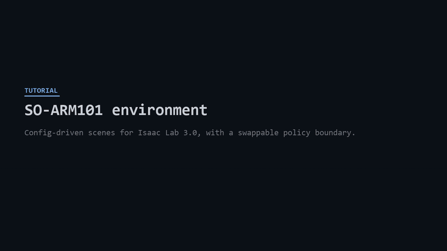

# SO-ARM101 environment for Isaac Lab 3.0

Simulation environment for the [SO-ARM101](https://github.com/TheRobotStudio/SO-ARM100)
(5-DOF arm + single-jaw gripper). Scenes are declared in YAML. What drives the arm — a
checkpoint, a teleop device, a policy server in another process — is set in the same file.

Tested on Isaac Sim 6.0.1 / Isaac Lab 3.0, Windows 11, RTX 4070 Ti.

## How to use it, in 69 seconds



Every frame is real command output, captured by [`scripts/make_tutorial.py`](scripts/make_tutorial.py)
rather than typed by hand — re-run it and the tutorial re-records itself. Sharper copy:
[`docs/tutorial.mp4`](docs/tutorial.mp4) (720p).

For a worked example of driving the env with an RL policy, see [`experiment/`](experiment/).

## Install

Needs an existing Isaac Lab 3.0 install (Isaac Sim 6.0.1, Python 3.12).

```bash
pip install -e .
```

Adds `pyzmq`, `msgpack`, `pyyaml`.

## Quick start

```bash
# standalone scene; prints the robot's real joint and body names
python scripts/scene_demo.py --steps 400 --num_envs 4

# run a YAML scene
python scripts/run.py --config configs/pick_place.yaml

# swap the driver
python scripts/run.py --config configs/pick_place.yaml --set control.source=zero

# validate a config without starting Isaac Sim
python scripts/run.py --config configs/pick_place.yaml --describe
```

## Scene config

```yaml
task: pick_place

scene:
  num_envs: 256
  robot:
    type: so101
    rot: [0.0, 0.0, 0.70710678, 0.70710678]   # (x,y,z,w) in Isaac Lab 3.0
    joint_pos: {shoulder_lift: -0.6, elbow_flex: 0.8, wrist_flex: 0.6}
  objects:
    cube:
      type: cuboid
      size: [0.025, 0.025, 0.025]
      pos: [0.20, 0.0, 0.0125]
  cameras:
    scene_cam:
      type: tiled
      prim_path: "{ENV_REGEX_NS}/SceneCam"
      resolution: [128, 128]

sim:
  episode_length_s: 5.0

control:
  source: rl_checkpoint            # zero | random | rl_checkpoint | zmq
  checkpoint: path/to/model.pt
  action_horizon: 1
```

Rewards and terminations stay in Python (`so101_scene/*_env_cfg.py`).

Unknown keys are rejected at parse time with the valid options listed, so a typo like
`resolutoin` fails instead of silently leaving the default.

### Registered names

| kind | names |
|---|---|
| robots | `so101` |
| objects | `cuboid`, `static_cuboid`, `usd` |
| cameras | `tiled` |
| sources | `zero`, `random`, `rl_checkpoint`, `keyboard`, `zmq` |

Add your own:

```python
from simbridge.registry import register_object

@register_object("my_widget")
def _widget(spec):
    return RigidObjectCfg(...)
```

## Task objectives

State the goal in the config, as a pattern:

```yaml
objective:
  pickable: [object]
  spawn: "box(0.20, 0.0, 0.0125, 0.03, 0.06, 0.0)"
  sequence: "pick[random] place[random(0.20, 0.0, 0.12, r0.06)]"
```

| form | meaning |
|---|---|
| `pick[object]` | that object |
| `pick[random]` | uniform over `pickable` |
| `pick[random(a, b)]` | uniform over a subset |
| `place[x, y, z]` | fixed point |
| `place[random(x, y, z, r0.06)]` | disc of that radius |
| `place[box(x, y, z, dx, dy, dz)]` | box, centre and half-extents |

Parsed by a fixed grammar — no model generates or interprets it, so a config always produces the
same task.

Regions are checked against the arm's measured envelope before Isaac Sim starts. Under 20%
reachable is rejected; 20–90% warns with the percentage. `place[random(0,0,0,r1)]` is a 1 m
radius on an arm that reaches 0.35 m, and fails with `only 12% reachable`.

Measured working area (`scripts/measure_workspace.py`, 1500 sampled configurations):

```
radial from base   0.02 .. 0.35 m      (0.33 m for a top-down grasp)
height above table 0.00 .. 0.45 m
```

Full reference: [docs/OBJECTIVES.md](docs/OBJECTIVES.md).

## LeRobot

[LeRobot](https://github.com/huggingface/lerobot) can teleoperate this environment, collect
datasets from it, or drive it with a trained policy. It runs in its own venv and talks over the
same ZeroMQ socket everything else uses.

```bash
# LeRobot venv
python scripts/lerobot_server.py mock              # or: teleop --port COM5
python scripts/lerobot_server.py policy --path outputs/train/act_so101/.../pretrained_model

# environment venv
python scripts/run.py --config configs/pick_place_lerobot.yaml --set control.source=zmq
```

Record a dataset `lerobot-train` reads directly:

```bash
python scripts/collect_dataset.py --config configs/pick_place_lerobot.yaml --episodes 200     --out datasets/so101_pickplace
```

Only successful episodes are kept. LeRobot's `SOFollower` uses the same joint order as this
articulation; units differ (arm −100..100, gripper 0..100) and are converted.

Full guide: [docs/LEROBOT.md](docs/LEROBOT.md).

## Tests

```bash
python scripts/run_all_tests.py          # fast tier, no simulator, ~20s
python scripts/run_all_tests.py --sim    # plus scene load, cameras, ZMQ-driven run
```

## Keyboard teleop

Two ways, depending on where you want focus.

**In the Isaac Sim window** — `control.source: keyboard`:

```bash
python scripts/run.py --config configs/pick_place_keyboard.yaml --steps 0
```

**From a separate terminal, over ZeroMQ** — same path a policy server uses:

```bash
# terminal 1
python scripts/teleop_server.py --action-dim 6

# terminal 2
python scripts/run.py --config configs/pick_place_teleop.yaml
```

| key | joint |
|---|---|
| `Q` / `A` | shoulder_pan |
| `W` / `S` | shoulder_lift |
| `E` / `D` | elbow_flex |
| `R` / `F` | wrist_flex |
| `T` / `G` | wrist_roll |
| `space` | toggle gripper |
| `N` | zero all targets |

Keys move a held target rather than applying a per-frame delta, so the arm stays where you put
it instead of springing back when you stop typing.

Joints are driven directly rather than through IK. Isaac Lab's `Se3Keyboard` emits end-effector
deltas, which need a solver — and on a 5-DOF arm that solver has to soft-weight orientation,
since the SO-101 cannot reach an arbitrary 6-DOF pose. Direct joint control avoids it and matches
the action space the tasks already use.

Use a long `episode_length_s` for teleop. At the default 5s the episode resets mid-manipulation.

## Driving from another process

Set `control.source: zmq` and the env becomes a client. The server imports no simulator, so the
policy can run under a different framework or on another machine.

```bash
# terminal 1
python scripts/policy_server.py --policy sine --action-dim 6

# terminal 2
python scripts/run.py --config configs/pick_place_teleop.yaml
```

A server is one function:

```python
from simbridge.schema import ObsPacket
from simbridge.transport import ZmqPolicyServer

def policy(obs: ObsPacket):
    obs.state["policy"]           # (num_envs, obs_dim) float32
    obs.images["scene_cam"]       # (num_envs, H, W, 3) uint8
    return my_model(obs)          # (num_envs, action_dim)

ZmqPolicyServer(policy, endpoint="tcp://127.0.0.1:5555").serve_forever()
```

### Messages

Two message types, msgpack-framed, version-checked. Arrays go over the wire as raw bytes with
shape and dtype.

| type | fields |
|---|---|
| `ObsPacket` | `step`, `num_envs`, `state{}`, `images{}`, `done`, `reward`, `info` |
| `ActionPacket` | `step`, `action (num_envs, action_dim)`, `reset`, `info` |

`step` is echoed back and checked; a mismatch raises instead of applying a stale action.

Transport is REQ/REP. Stepping is lock-step, so the reply is what unblocks the env. Client
timeouts are on by default, so a dead server raises rather than hanging the sim.

Throughput: 432 MB/s, dead-server timeout in 0.8s.

### Action chunking

`ActionSource` caches a predicted chunk and re-plans when it runs out. Set
`control.action_horizon` to the number of steps to execute open-loop. Per-step drivers return a
chunk of length 1.

Interface follows [NVlabs/RoboLab](https://github.com/NVlabs/RoboLab)'s `InferenceClient`.
RoboLab itself won't install here — it pins Isaac Sim 5.0/5.1, Isaac Lab 2.2/2.3, Python 3.11,
Ubuntu.

## Robot

From spawning it, not from the USD:

```
DOF         : 6
joint_names : shoulder_pan, shoulder_lift, elbow_flex, wrist_flex, wrist_roll, gripper
body_names  : base, shoulder, upper_arm, lower_arm, wrist, gripper, moving_jaw_so101_v1
```

| joint | limits (rad) |
|---|---|
| `shoulder_pan` | -1.920 … +1.920 |
| `shoulder_lift` | -1.745 … +1.745 |
| `elbow_flex` | -1.690 … +1.690 |
| `wrist_flex` | -1.658 … +1.658 |
| `wrist_roll` | -2.744 … +2.841 |
| `gripper` | -0.175 … +1.745 |

End-effector body is `gripper`. There is also a joint named `gripper`.

Two gotchas:

- 5 DOF can't hit an arbitrary 6-DOF pose. Soft-weight orientation in task-space controllers.
- `SO101_CFG`'s default joint pose points the arm away from the workspace. The configs here seat
  it in a crouch with a 90° base yaw.

## Tasks

| id | description |
|---|---|
| `SO101-Reach-v0` | reach a random EE pose |
| `SO101-PickPlace-v0` | pick a 2.5 cm cube, place at a commanded pose |
| `SO101-PickPlace-Play-v0` | 16 envs, no obs noise |
| `SO101-PickPlace-Wide-v0` | wider cube spawn range |
| `SO101-PickPlace-Blind-v0` | cube position removed from obs (diagnostic) |

## Scripts

| script | use |
|---|---|
| `scene_demo.py` | load the robot, print joint/body names and limits |
| `diagnose_scene.py` | print world positions of base, EE, object, goal |
| `measure_ee.py` | measure the grasp point between the jaws |
| `dump_camera_views.py` | save one frame per camera + pixel stats |
| `measure_workspace.py` | measure the arm's reachable envelope and graspability |
| `collect_dataset.py` | record a LeRobot dataset from any driver |
| `lerobot_server.py` | LeRobot teleop or policy, over ZeroMQ |
| `run_all_tests.py` | the whole test suite |
| `run.py` | run a YAML scene with any driver |
| `policy_server.py` | serve actions over ZeroMQ |
| `teleop_server.py` | keyboard teleop over ZeroMQ, no simulator needed |

Most bugs in this repo came from guessing geometry — a grasp offset off by a cube width, an arm
facing away from its workspace. These print the real numbers.

## Layout

```
so101_scene/     task definitions: rewards, terminations, robot tuning
simbridge/       schema, interfaces, transports, YAML builder
configs/         scene configs
scripts/         env utilities and the runner
experiment/      RL example
```

Self-checks:

```bash
python -m simbridge.schema
python -m simbridge.interfaces
python -m simbridge.transport.test_roundtrip
```
