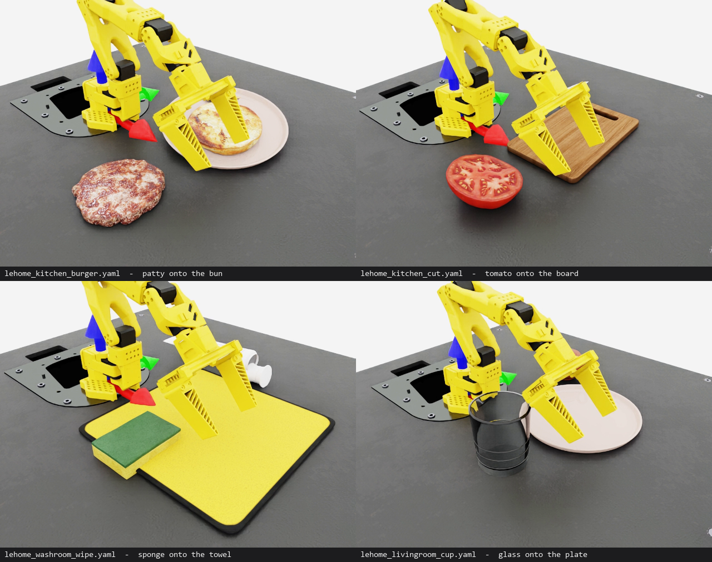
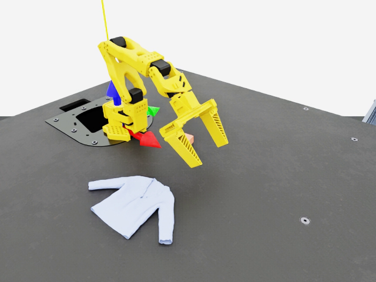

# LeHome: household assets and tasks, adapted

[LeHome](https://github.com/lehome-official/lehome) is a simulation environment for deformable
object manipulation in household scenarios — a one-bedroom apartment, seven tasks across four
rooms, and a large library of household props. It drives the same robot this repo does: the
SO-101.

This page is the account of what crossed over into this repo, what did not, and why. The short
version: **the assets came over whole, the code came over not at all.**

```bash
python scripts/fetch_lehome.py                 # ~1.7 GB, once
python scripts/run.py --config configs/lehome_kitchen_burger.yaml --steps 0 --viz kit
```

## Attribution

The assets are LeHome's, downloaded unmodified from their HuggingFace release
[`lehome/lehome_release`](https://huggingface.co/datasets/lehome/lehome_release), which is
licensed **CC-BY-4.0**. They are not committed here — `scripts/fetch_lehome.py` fetches them and
`assets/lehome/` is gitignored. If you redistribute anything built on them, that licence travels
with it.

```bibtex
@inproceedings{li2026lehome,
  title={{LeHome}: A Simulation Environment for Deformable Object Manipulation in Household Scenarios},
  author={Zeyi Li and Yushi Yang and Shawn Xie and Kyle Xu and Tianxing Chen and others},
  booktitle={2026 IEEE International Conference on Robotics and Automation (ICRA)},
  year={2026}
}
```

## What came over

**45 named props**, in `simbridge.objective.LEHOME_CATALOGUE`, usable from any config:

```yaml
scene:
  objects:
    object:
      type: lehome
      name: burger_patty
      pos: [0.22, -0.10, 0.010]
    plate:
      type: lehome
      name: burger_plate
      pos: [0.22, 0.10, 0.008]
      static: true            # scenery: no rigid body, cannot be knocked over
```

A typo raises with the full list. A prop the gripper cannot close on prints a warning naming the
measured width. Keys: `name`, `pos`, `rot`, `scale`, `mass`, `static`, `static_friction`,
`dynamic_friction`, `collision_approximation`.

**Four adapted task configs**, one per LeHome room:



| config | adapted from | what it kept | what it dropped |
|---|---|---|---|
| `lehome_kitchen_burger.yaml` | `loft_burger_bi` | the burger parts, the stacking | the second arm, deformable buns |
| `lehome_kitchen_cut.yaml` | `loft_cut_bi` | the board, tomato and knife | **the cutting** |
| `lehome_washroom_wipe.yaml` | `loft_wipe` | the sponge and towel | particle cloth, the stain, the wipe check |
| `lehome_livingroom_cup.yaml` | `loft_water` | the glassware | **the water** |
| `lehome_bedroom_shirt.yaml` | `garment_bi` | the garment, simulating and grippable | the second arm, **the folding** |

Each config's header says what it is not. A task called "cut" that quietly does not cut is worse
than one that says so.

Clips, rendered from these configs by `scripts/capture_clip.py`:
[burger](lehome/lehome_kitchen_burger.mp4) ·
[cut](lehome/lehome_kitchen_cut.mp4) ·
[wipe](lehome/lehome_washroom_wipe.mp4) ·
[cup](lehome/lehome_livingroom_cup.mp4)

## What did not come over, and why

**The code.** LeHome targets Isaac Sim 5.1 / Isaac Lab 2.3.1; this repo is 6.0.1 / 3.0. That is
not a version bump: their tasks are direct-workflow `DirectRLEnv` subclasses with hardcoded
apartment coordinates, ours are manager-based with a YAML builder in front. Quaternions changed
convention between the two Isaac Lab lines — LeHome writes `rot=(1, 0, 0, 0)` for identity
(w, x, y, z), this repo writes `(0, 0, 0, 1)` (x, y, z, w). Their GitHub repository also carries
no licence file, so copying it would not have been ours to do. Nothing was copied; the assets
were downloaded from their published release and the task *ideas* re-implemented.

**Bimanual.** Six of LeHome's seven tasks run two SO-101 arms (`*_bi`). This repo has one, and a
second arm is not a config change — it is a second action space, a second IK chain, and a reward
structure that has to coordinate them. `loft_wipe` and `loft_water` are their single-arm tasks
and are the two adapted most faithfully. **Folding is the task this actually blocks**: the
garment itself now simulates here (below), but folding a shirt one-handed is not a smaller
version of LeHome's task, it is a different one.

**PhysX particle cloth and fluid.** LeHome's `GarmentObject` and `FluidObject` build PhysX
particle systems. This repo's deformable path is Newton's VBD solver — a different solver with
different assets and different parameters (see [PHYSICS.md](PHYSICS.md)). The *garment mesh* does
cross over (below); the particle machinery around it does not, so a LeHome towel is scenery and
`type: cloth` is the real thing. There is no fluid at all: Newton ships `SolverImplicitMPM`,
Isaac Lab's `NewtonCfg` does not expose it, and nothing in this repo pours.

## The shirt

```bash
python scripts/run.py --config configs/lehome_bedroom_shirt.yaml --steps 0 --viz kit
```



LeHome's shirt runs here as Newton VBD cloth, with self-collision on. The asset is committed at
`assets/garment/shirt.usd`, so that config needs no download; `scripts/make_garment.py`
regenerates it from the LeHome source at any particle spacing.

It drapes, folds and self-collides. **It cannot be picked up**, and that is measured rather
than assumed: a scripted grasp pans the gripper over the shirt with 564 particles between the
jaws, closes, and lifts 100 mm — and the cloth does not move by a tenth of a millimetre. Contacts
here are per-particle and `enable_rigid_soft_full_surface_contact` is unavailable (the SO-101's
collision meshes carry no SDF), so a thin finger closing on a sheet has nothing to pinch. Finer
particles would help and a wider pinch surface would help more; neither is a config change.

It is also **not** LeHome's folding task — see Bimanual above. Folding wants two arms; this
arm cannot lift the cloth with one.

Three findings, all measured, in [PHYSICS.md](PHYSICS.md):

- the source mesh **diverges at step 7** — 14,746 vertices means 2.4 mm triangles against a 2 mm
  particle radius, so the particles start out overlapping;
- **quadric decimation cannot self-collide.** At the same vertex count it leaves edges spanning
  0.21–35.5 mm (170x); voxel clustering gives 1.04–11.07 mm (11x). A self-contact radius has to sit
  under the smallest edge, and at 0.21 mm there isn't one;
- self-collision still tore the shirt apart in 60 steps until
  `particle_rest_shape_contact_exclusion_radius` was raised off its **0.0** default.

Shipped at 6 mm spacing: 2,572 particles, 24.8 steps/s at 1 environment.

**Mesh cutting.** `loft_cut_bi` rebuilds the tomato mesh at the knife plane
(`utils/cutMeshNode.py`). There is no mesh surgery here.

**Fire.** `Plasmas/Fire` is an Omniverse Flow preset. The stovetop asset references it at a path
that is not in the objects download, so it warns and renders without flame.

**The apartment.** `scenes/1BRAPT_LeHome` is 4.8 GB, and this arm reaches 300 mm from a table.
`python scripts/fetch_lehome.py --what scene` will download it if you want it as a backdrop;
nothing here places the robot inside it.

Also left behind: LeHome's success checkers, their action-graph manipulation mechanisms, their
whitelist scene-deactivation machinery, and their LeRobot training configs.

## What the assets actually are — measured

Full table in [lehome_objects.txt](lehome_objects.txt), regenerated by:

```bash
python scripts/measure_lehome.py
```

It opens every USD (no Kit app needed — seconds, not minutes) and reports bounding box, authored
mass, and which physics schemas the file carries. Three results worth knowing before using any of
this:

**Only 33 of the 45 named props author a rigid body.** The rest are visual meshes with a mass and
no collider, exactly like Isaac Sim's YCB props. `simbridge`'s spawner defines the schemas for
those after the spawn; the catalogue records which camp each asset is in, and the measure script
fails the check if the flag drifts from the file.

**The ones that do put the rigid body on a child of the default prim** — `/root/Bowl016`, not
`/root`. Isaac Lab's `modify_rigid_body_properties` addresses `prim_path` itself, so a
`rigid_props` on the `UsdFileCfg` lands on a prim with no API and raises. The spawner finds the
body first.

**Nothing in the library authors a deformable schema.** The `_Def.usd` variants LeHome loads as
`DeformableObjectCfg` are plain meshes with a mass — PhysX applies the deformable API at spawn
from LeHome's config, it is not stored in the file. Under Newton those files are rigid visual
meshes. This is the single biggest thing that did not survive the port, and it is invisible from
the filenames.

## A friction bug this turned up, in code that predates it

Both spawners here define collision schemas *after* the USD is on the stage, because these assets
ship without them. `spawn_from_usd` binds the config's friction material during the spawn — before
any collider exists — so the bind found nothing and logged a warning:

```
[Warning] Could not perform 'bind_physics_material' on any prims under: '/World/envs/env_0/Object'
```

A warning, not an error. The prop spawned, simulated, and used whatever friction its USD happened
to ship, silently ignoring `static_friction` / `dynamic_friction` in the config. **This applied to
the YCB props too**, which have been in this repo far longer — the LeHome work is only what made
it visible. Measured on the stage after the fix, reading the binding back rather than trusting the
absence of a warning:

| config | collider | bound physics material |
|---|---|---|
| `pick_place_props.yaml` (YCB gelatin box) | `Object/_09_gelatin_box` | static 1.2, dynamic 1.0 |
| `lehome_kitchen_burger.yaml` | `.../Burger_Beef_Patties001_Collider1` | static 1.2, dynamic 1.0 |
| `lehome_washroom_wipe.yaml` | `.../Sponge001/Visuals/Sponge001` | static 1.2, dynamic 1.0 |

The patty's own asset material is static 0.5 / dynamic 0.4, so this is a real change in behaviour
for anything grasping one, not a cosmetic tidy-up. Both spawners now hold the material out of the
spawn and apply it once the colliders are there.

## Two things that will bite you

**Scale.** These are real-world household objects: the burger bun is 131 mm across, the plate 227
mm, the refrigerator 824 mm. The SO-101 reaches 300 mm and its reference cube is 25 mm. That
mismatch is LeHome's too — they drive the same arm — and what makes the tabletop tasks work is
the **parallel gripper**, which opens 128.6 mm where the single jaw opens 36 mm. Every adapted
config specifies `type: so101_full` for that reason; `lehome_livingroom_cup.yaml` is the clearest
case, since a 91 mm glass is simply not holdable by the single jaw.

Of the 45 props, 36 fit the parallel gripper and 9 do not — and the 9 are appliances and bedding,
which were never payloads. Against the single jaw the numbers are 12 and 33.

**Lift height.** The task's `lifting_object` reward fires above `minimal_height = 0.025`, tuned
for a 25 mm cube whose centre sits at 12.5 mm. A household prop is taller: LeHome's glass cup
rests with its origin **51 mm** up, so the reward pays out in full at step 0 with the arm still
parked, and the curve starts at its ceiling. That is not visible from watching the scene. Set it:

```yaml
sim:
  lift_height: 0.090      # resting centre height + ~30 mm of clearance
```

Every adapted config sets it, and `simbridge.builder.apply_lift_height` raises rather than
silently doing nothing if the task has no such term.

## Nothing has been trained on any of this

The shipped PPO checkpoint is a rigid-cube expert on the single jaw. All four configs are driven
by `zero`; swap `control.source` to `keyboard` to drive them by hand.
