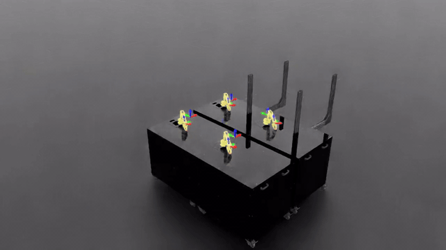

# Task objectives

State what a task is trying to achieve in the config, as a pattern:

```yaml
objective:
  pickable: [object]
  spawn: "box(0.20, 0.0, 0.0125, 0.03, 0.06, 0.0)"
  sequence: "pick[random] place[random(0.0, 0.20, 0.12, r0.06)]"
```

It is parsed by a fixed grammar — a regex and a few dataclasses. No model generates or
interprets it, so the same config always produces the same task.

## Grammar

```
pick[<selector>] place[<region>]
```

A colon after `pick`/`place` is optional, so `pick:[object]place:[0,0,0]` works too.

### Selectors

| form | meaning |
|---|---|
| `pick[object]` | that specific object |
| `pick[random]` | uniform over `objective.pickable` |
| `pick[random(cube_red, cube_blue)]` | uniform over a named subset |

Names are checked against `pickable`. A typo fails at parse time.

### Regions

| form | meaning |
|---|---|
| `place[0.0, 0.20, 0.12]` | fixed point |
| `place[random(0.0, 0.20, 0.12, r0.06)]` | uniform in a disc of radius 0.06 m at that height |
| `place[box(0.0, 0.20, 0.12, 0.10, 0.03, 0.02)]` | uniform in a box, centre then half-extents |

The radius is written `r<R>`. `random(x, y, z, 0.06)` is rejected — without the prefix there is
no way to tell a radius from a fourth coordinate.

`spawn` takes the same region forms and sets where the object starts. Both are written as
absolute coordinates in the environment frame, and each is converted for you: `spawn` into the
offset Isaac Lab's reset event expects, `place` into the robot root frame the command ranges use.
See [Which frame the numbers are in](#which-frame-the-numbers-are-in).

## Where the SO-ARM101 can work

Measured by `scripts/measure_workspace.py`, which drives 1500 random joint configurations and
reads where the gripper ends up. Base at the origin, +x forward.

| | range | absolute max |
|---|---|---|
| radial distance from base | 0.02 – 0.35 m | 0.370 m |
| height above table | 0.00 – 0.45 m | 0.460 m |

The ranges are 1st–99th percentile. The absolute extremes are single fully-extended
configurations — technically reachable, not usable.

**A top-down grasp is more restrictive.** Only 28% of sampled configurations point the gripper
downward, and those reach 0.33 m rather than 0.35 m. A place target is only a position so this
is not enforced, but a *pick* location outside it is unlikely to be graspable from above.

## Which frame the numbers are in

Every coordinate in a config is in the **environment frame** — the same frame as
`scene.robot.pos` and a camera's `pos` / `look_at`.

Isaac Lab's pose command ranges are in the robot *root* frame, and this arm's base is rotated
90° about z, so `place` is converted for you by `simbridge.objective.to_root_frame`. Before that
conversion existed, `place[0.20, 0.0, 0.10]` landed at env `(0.000, 0.200, 0.100)` — 0.30 m from
a cube the same file spawned at `(0.200, 0.000, 0.010)`. Nothing reported it, because both
positions were individually reachable.

Read the goal back out of a running scene to check any config:

```bash
python scripts/diagnose_scene.py --config configs/variants/goal_left.yaml
```

Practical areas for a cube-on-table task:

```
spawn (on the table)   x 0.15..0.26   y -0.10..0.10   z = half the cube height
place (in the air)     x -0.10..0.10  y  0.15..0.25  z 0.06..0.16
```

Those sit 90° apart around the base. That is inherited: the goal ranges come from upstream
`contrib.lift`, written for a Franka, and this base is rotated, so the shipped checkpoint
learned to carry the cube round to the side — at 92% success. Goals in front of the arm are
just as legal and just as reachable; they need a retrain, since the checkpoint never saw them.

## Reach checking

Every region is checked before Isaac Sim starts.

| reachable fraction | result |
|---|---|
| < 20% | rejected |
| 20–90% | accepted with a warning naming the percentage |
| > 90% | accepted silently |

The fraction is estimated by sampling the region (deterministic seed, so a config validates the
same way every run).

Fraction, not nearest-and-furthest-point, because those measures pass regions that are almost
entirely unreachable. From the original sketch:

```yaml
sequence: "pick[random] place[random(0, 0, 0, r1)]"
```

Its nearest point is 0 m from the base, so a distance check sees nothing wrong. It is a 1 m
radius on an arm that reaches 0.35 m:

```
place region is only 12% reachable; the arm works between 0.02 and 0.35 m from its
base and up to z=0.45 m.
  region: disc(centre=(0.000, 0.000, 0.000), r=1.000)
  most episodes would be impossible, so the task could not train.
```

This check exists because unreachable goals have already cost two training runs here. They do
not fail loudly — the reward stays flat and it looks like a broken policy, which is a much more
expensive thing to debug than a config error.

## What it looks like



The policy picking the cube and carrying it to a goal sampled from
`place[random(0.0, 0.20, 0.12, r0.06)]`. The goal moves between episodes because the region is a
disc, not a point.

## Trying it

```bash
# parse and validate, no simulator (milliseconds)
python scripts/run.py --config configs/pick_place_objective.yaml --describe

# run it
python scripts/run.py --config configs/pick_place_objective.yaml
```

`--describe` prints the resolved objective and spawn region. Warnings appear there too, so a
partly-unreachable goal is visible before committing to a run.

## Errors

Every failure names the problem and what was expected.

| config | message |
|---|---|
| `place[random(0,0,0,r1)]` | `only 12% reachable; the arm works between 0.02 and 0.35 m` |
| `pick[apple]` with `pickable: [object]` | `pick names ['apple'] are not in objective.pickable ['object']` |
| `place[0.2, 0.0]` | `expected 3 numbers, got 2` |
| `place[random(0.2, 0, 0.1, 0.06)]` | `radius must be written r<R>, got '0.06'` |
| `grab[x] drop[y]` | `could not parse objective`, with the grammar and an example |

## Self-check

```bash
python -m simbridge.objective
```

Covers the grammar, the colon form, subsets, boxes, and both the rejection and warning paths.

## Note on generated tasks

NVIDIA's [RoboLab](https://research.nvidia.com/labs/srl/projects/robolab/) specifies tasks as
natural-language instructions and generates layouts with an LLM agent. That suits a benchmark of
120+ tasks where variety is the point.

This goes the other way deliberately: a fixed grammar, parsed the same way every time, with the
robot's measured envelope as a hard constraint. A task either parses or it does not, and if it
parses the arm can reach it.
