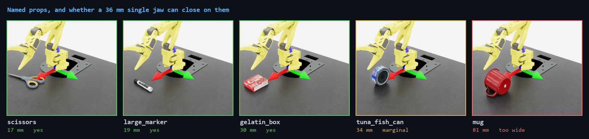

# Objects a task can pick

Two kinds, both named in `scene.objects` and referred to from `objective.pickable`:

```yaml
scene:
  objects:
    object:                       # `object` is the name the pick_place task expects
      type: ycb
      name: gelatin_box
      pos: [0.20, 0.0, 0.02]

objective:
  pickable: [object]
  sequence: "pick[object] place[0.0, 0.20, 0.12]"
```

| type | what it is |
|---|---|
| `cuboid` | a coloured box: `size`, `color`, `mass`, friction |
| `ycb` | a named prop from Isaac Sim's YCB set (below) |
| `static_cuboid` | a prop that collides but never moves — pedestal, wall |
| `usd` | any USD by path or URL |

> **This page is about the `so101` single-jaw robot.** It does not apply to `so101_full`,
> whose parallel gripper measures 56.2 mm closed and 128.6 mm open at the finger origins. Every
> "too wide" verdict below is a statement about a 36.2 mm jaw. Re-run
> `python scripts/measure_objects.py` and re-derive the table before trusting any of it for the
> parallel gripper — most of these props probably become pickable.

## The catch: this arm has one jaw

**There is no apple and no orange in Isaac Sim's YCB set.** There are 21 props, and of those,
**three are comfortably pickable by the SO-101 and one is marginal.** The rest are wider than the
gripper.

The SO-101 has a single moving jaw whose bodies sit about 36 mm apart. The *shortest side* of an
object is what has to fit between the jaws, so a mug fails at 81 mm however light it is.



Each is the shipped `configs/pick_place_props.yaml` with one word changed — `name: gelatin_box`
becomes `name: mug` — rendered by `scripts/capture_clip.py`.

### Pickable

| prop | shortest side | |
|---|---|---|
| `scissors` | 17 mm | |
| `large_marker` | 19 mm | |
| `gelatin_box` | 30 mm | closest in size to the task's own 25 mm cube |
| `tuna_fish_can` | 34 mm | marginal — within 15% of the jaw |

### Too wide

`large_clamp` 36 · `extra_large_clamp` 36 · `pudding_box` 38 · `banana` 39 · `sugar_box` 45 ·
`foam_brick` 51 · `bowl` 55 · `power_drill` 57 · `potted_meat_can` 58 · `mustard_bottle` 58 ·
`tomato_soup_can` 68 · `bleach_cleanser` 68 · `cracker_box` 72 · `mug` 81 · `wood_block` 90 ·
`master_chef_can` 102 · `pitcher_base` 133 (mm)

Full table with longest sides: [`objects.txt`](objects.txt).

### Where the numbers come from

Measured, not read off the YCB spec sheet:

```bash
python scripts/measure_objects.py
```

It opens each asset, computes its bounding box, and compares the result against
`simbridge.objective.PROP_CATALOGUE` — so if the assets change, or the table was transcribed
wrong, the run says so instead of quietly deciding your config is invalid. The first version of
that table had `banana` at 39.4 mm against a real 38.6 mm, which is exactly the drift the check
is for.

**The 36.2 mm jaw figure is soft.** `measure_workspace.py` reports it as the separation between
the two jaw *body origins*, and found no measurable travel between the closed and open extremes —
the revolute jaw sweeps its tips while the origins stay put. So treat the boundary as ±a few mm:
`tuna_fish_can` may well work, and something slightly over may too. What it does rule out
confidently is the 100 mm end of the list.

## Naming something too wide

It warns rather than fails, because the jaw figure is soft and a task may want an object it
pushes rather than lifts:

```
[config] warning: pick[object] is 81 mm across its shortest side, jaw is 36.2 mm;
                  the arm cannot close on it (see docs/OBJECTS.md)
```

The check runs at config-parse time, before Isaac Sim starts, for the same reason as the reach
check: a policy will not learn to lift what the gripper cannot hold, and that failure looks
exactly like a broken policy — a flat reward curve after an hour of training.

## What `type: ycb` does for you

These assets are visual meshes. They ship with no rigid body, no collider and no mass, so
pointing a `RigidObjectCfg` straight at one fails with `Could not perform
'modify_rigid_body_properties'` followed by `Expected 1 prims, found 0` — Isaac Lab's
`UsdFileCfg` only *modifies* physics that already exists.

`type: ycb` spawns the visuals and then defines the physics: a rigid body and mass on the root, a
convex-hull collider on each mesh. Two choices worth knowing:

- **Mass defaults to 30 g**, not to whatever PhysX derives from density — which would be about
  200 g for the gelatin box, against a 15 g reference cube. Override with `mass:`.
- **Friction defaults to 1.2 / 1.0**, matching the task's cube. A single jaw pinches rather than
  encloses, so the grasp is friction-limited and the shipped material is tuned for a parallel jaw.
- **Convex hull, not convex decomposition.** Decomposition is what made a Newton scene build cost
  ~900 CPU-seconds here, and these props are convex enough.

Assets stream from the Isaac asset server, so the first spawn of each needs a network connection
and is slow. Later runs hit the local cache.

## Trying it

```bash
python scripts/run.py --config configs/pick_place_props.yaml --describe
python scripts/run.py --config configs/pick_place_props.yaml
```

Swap `name: gelatin_box` for any other prop; nothing else in the config changes.

The shipped PPO checkpoint was trained on the 25 mm cube, so it is not an expert on these. They
are a starting point for a new task, not a drop-in swap.
