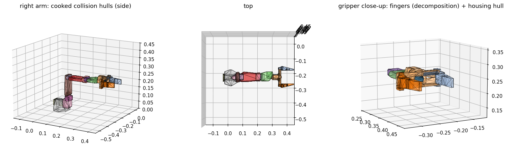

# VR teleoperation: a Quest controller drives the SO-101

```bash
# terminal 1 -- the bridge. Serves the page the headset opens and answers the simulator.
python scripts/vr_gripper_server.py

# terminal 2 -- the simulator, on the monitor
python scripts/run.py --config configs/vr_teleop.yaml --viz kit --steps 0

# on the Quest: open the URL the bridge printed (https://<this PC's LAN IP>:8443/),
# accept the certificate once, press Enter VR.
```

Or set the scene up in a window first and press Start — `python scripts/scene_gui.py` — which
writes the YAML and launches both of the above.

| right Touch controller | |
|---|---|
| **GRIP** (hold) | move the arm — and turn it: the fingers follow the controller's rotation, relative to how they pointed when you gripped. A clutch, like lifting a mouse: let go, reposition your hand, grip again — the arm stays where it was |
| **TRIGGER** (hold) | close the jaw |
| **A** | re-centre: the grasp point returns to `--home` |
| **B** | reset the scene: objects back to their start, arm to its rest pose, target home |

**With a Link cable, use the PC's browser instead:** start the bridge with `--no-tls`, open
`http://localhost:8443/` in Chrome or Edge, Enter VR — the session goes to the headset through
the Meta runtime, and `localhost` is a secure context so there is no certificate step at all.
That is the route verified on hardware.

**What you see in the headset is a floating screen** showing the simulator's camera — 1.2 m
wide, 1.5 m in front of where you stood when the session began, at chest height. The first
version showed nothing at all: passthrough is not available through Chrome over Link, so the
`immersive-vr` fallback was a black void and the operator had to steer from the monitor. The
frame gets there without a new socket: `run.py` attaches each declared camera's image to the
observation packet every third step, the bridge JPEG-encodes it at up to 15 Hz and pushes it
down the same WebSocket the controller comes up, and the page draws it on one textured quad.
It is also drawn on the page itself, so the stream can be checked from any browser.

## The same controller, flying a gripper with no arm

```bash
python scripts/vr_gripper_server.py --free          # add --fake for a scripted controller
python scripts/floating_gripper.py --stream --viz kit
```

Same bridge, same page, same buttons, same eight numbers on the socket — the simulator on the
other end is `scripts/floating_gripper.py` instead of the arm, so the jaws go exactly where the
controller goes with nothing to reach around them. This is the closest thing here to holding an
object in a VR game, and it is what a UMI-style demonstration wants: the operator's motion, not
an arm's approximation of it.

Two flags are what make it work, and both are about the difference between a gripper on an arm
and a gripper on nothing:

**`--free` on the bridge** turns off the yaw lock. That lock exists because the arm's finger
heading *is* its base yaw, so a commanded heading the base cannot reach costs the IK 37 mm of
position (above). A free gripper has no base, so the lock would instead turn the jaws by
wherever the operator happens to be standing.

**`--stream` on the simulator** attaches a 720x540 view to the observation packet, which is what
puts a picture on the headset's floating screen. Without it the operator is flying blind — the
arm path gets this for free from `scene.cameras` in the YAML, and the floating gripper's scene
has no camera unless asked for one.

The bridge anchors the operator on `ee_pose`, the grasp point read back out of the simulator, so
the first squeeze of the grip button never jumps: the floating gripper reports the midpoint
between its jaws (`GRASP_OFFSET` rotated into the world), which is the same point the action
commands. It also spawns already pointing down, because the bridge takes the first steady pose
the simulator reports as its orientation target — spawned at identity, it was handed "jaws
sideways" as the thing to hold.

Checked with no headset: `python scripts/vr_gripper_server.py --demo` (frames, clutch, jaw, the
yaw lock and its absence under `--free`), and the two processes run together with `--fake`,
which takes home from the simulator's start pose (0.200, 0.300, 0.275), moves the gripper the
155 mm the script asks for, and latches the jaws shut on the trigger. What the scripted
controller does *not* do is complete a pick — its motion is written around the arm's workspace.
The grasp physics are checked separately, by `python scripts/floating_gripper.py --demo`, which
lifts the block and puts it down 140 mm away.

### Known: `--stream` and `--record` render blank on this install

Camera sensors produce nothing in a **standalone** script -- `SimulationContext` +
`InteractiveScene`, which is what `floating_gripper.py` is -- while the manager-based path
(`gym.make`, used by `scripts/run.py` and `scripts/capture_clip.py`) renders the same scene
correctly at the same moment. Every pixel comes back 245.

Not this repo. Isaac Lab's own unmodified tutorial shows it, which is how it was pinned down:

```bash
python IsaacLab/scripts/tutorials/04_sensors/add_sensors_on_robot.py --num_envs 1
```

with `args_cli.enable_cameras = True` set after `parse_args` (this build has no
`--enable_cameras` flag), printing the rgb tensor instead of its shape: `min 245 max 245 uniq 1`.
Depth comes back `inf` across the whole frame, so it is the geometry that never reaches the
render delegate, not the lighting. The renderer logs
`readTransformsFromFabricInRenderDelegate and geometry streaming are enabled together but this
can cause issues`; turning either off through carb hangs Kit on startup, so that is not the
workaround. Isaac Sim 6.0.1 / Isaac Lab 3.0 `develop@a384e2f`, driver 596.49, RTX 4070 Ti.

Two things that are *not* the cause, both checked: a stale Isaac process holding VRAM (that
does break rendering -- 6.8 of 12 GB gone made `capture_clip.py` blank too -- but freeing it
fixed only the manager-based path), and the camera's aim.

`floating_gripper.py` says so rather than writing a white file: `warn_if_blank` prints once on
the first frame if every pixel is identical. Until it is fixed, drive the gripper from the
monitor, or use the immersive route (`--vr`), which renders through Kit's own XR pipeline and
does not go through a camera sensor at all.

## Why not Isaac Lab's own XR teleop

Isaac Lab ships one (`isaaclab_teleop`, CloudXR, `--xr`), and its guide is explicit:

> XR teleoperation is supported on **Linux x86_64 only**. The `teleop` extra gates `isaacteleop`
> and `dex-retargeting` behind platform markers, so on Windows or aarch64 the extra resolves but
> installs nothing usable.

`scripts/floating_gripper.py` already carries the other Windows-capable route — Kit's own
`omni.kit.xr.system.openxr` over Quest Link, with hand tracking, driving an arm-less gripper. It
is the *immersive* fork of this problem and is unverified on hardware for the same reason this
page is. The two share `hand_tracker.Clutch` and the 8-wide action, so whichever gets a headset
first informs the other.

## How it is put together

```
Quest browser  --WebXR-->  scripts/vr/index.html  --WSS JSON @60Hz-->  vr_gripper_server.py
                                                                            |  clutch, frame
                                                                            |  conversion, jaw
                                                             ZeroMQ REQ/REP |  8-wide action
                                                                            v
                                             run.py + control.actions: ik  -->  SO-101 arm
```

One message shape, `{pos, quat, trigger, squeeze, recentre}` in WebXR's `local-floor` frame.
One action shape, `[x, y, z, qx, qy, qz, qw, jaw]` in the robot's root frame — the same eight
numbers the webcam hand tracker sends to the floating gripper, so the simulator side neither
knows nor cares which device is on the socket.

**`control.actions: ik`** is the new piece on the simulator side. It swaps the task's five
joint-offset actions for Isaac Lab's `DifferentialInverseKinematicsAction`: the arm is
commanded by a grasp-point pose and damped-least-squares IK finds the joints. Isaac Lab 3.0
takes the quaternion as `(x, y, z, w)` — its identity fallback is `[0, 0, 0, 1]` — and the
command is in the articulation root frame, which for `so101_full` at identity rotation is the
env frame.

**Frames.** WebXR is +x right, +y up, −z forward; the scene is +x forward, +y left, +z up. The
mapping is one permutation matrix in `webxr_to_sim`, applied to positions directly and to
orientations as `P R Pᵀ` — permuting a quaternion's components instead is wrong for exactly the
reason it looks right. The bridge's `--demo` checks a controller held forward, left and up.

**Orientation follows the controller, relative to the arm.** Each step the simulator puts the
grasp point's pose in the root frame on the packet (`state["ee_pose"]`). When the grip closes,
the bridge anchors *both* the controller's orientation and the fingers' actual orientation; from
then on the target is "however far the controller has turned since, applied to how the fingers
pointed then". Two things fall out of that. The arm never has to jump to an orientation it may
not be able to reach — the target starts at zero error and moves only as fast as your wrist.
And it is what fixed the gripper "rotating by itself": with orientation unweighted, five joints
against three position constraints left `wrist_roll` free to spin without moving the grasp
point, and damped least squares let it. The first session showed exactly that. Orientation now
carries weight 0.3 in the IK, measured below. `--no-track-rot` pins it instead.

**HTTPS.** WebXR refuses to start from a plain `http://` page on anything but `localhost`. The
bridge generates a self-signed certificate for this PC's LAN address on first run
(`scripts/vr/cert.pem`, gitignored) and serves page and WebSocket on one port. The Quest
browser will warn once — Advanced → proceed — and then remember it.

## What is verified, and what is not

Everything below the page is exercised without a headset, in two ways:

- **`python scripts/vr_gripper_server.py --fake`** replaces the page with a scripted controller
  — reach down, grip, close, lift, carry left, release — fed into the same `push()` the page
  hits. The simulator then runs the production path end to end.
- **The page's "Mouse test" button** drives the same message from an ordinary browser. Run
  with `--no-tls`, open `http://localhost:8443/`, drag on the panel. Verified here: the page
  connected, reconnected on its own when the bridge restarted, and the bridge counted 2,299
  messages from it while answering the simulator's requests.

| | status |
|---|---|
| bridge: frame mapping, clutch edges, jaw, hold-on-silence | **verified**, `--demo` |
| page → WebSocket → bridge → ZeroMQ → action | **verified**, mouse mode in a browser |
| page served over HTTPS with the generated certificate | **verified**, `curl -k` |
| `control.actions: ik` builds an 8-wide action on the grasp point | **verified**, tests |
| fake controller → IK → arm follows the pose, grasps and lifts a block | **verified** — 4–20 mm tracking, block carried; measurements below |
| the page with a real controller: session, `gripSpace`, frame mapping, button indices | **verified on a Quest 3 over Link, through desktop Chrome** — raw numbers below |

The button mapping follows the WebXR `xr-standard` profile — 0 trigger, 1 squeeze, 4 A/X —
and the frame conversion follows the spec; both were "derived, not measured" until the first
session with hardware, which the bridge logged (it prints the first messages and every 300th):

```
[vr] page connected from 192.168.1.103              <- Chrome on the PC, over Link
[vr] page msg 300: webxr pos=(+0.269,+0.181,-0.394) -> sim (+0.394,-0.269,+0.181)  squeeze=0.00 trigger=0.00
[vr] page msg 600: webxr pos=(+0.262,+0.497,-0.345) -> sim (+0.345,-0.262,+0.497)  squeeze=1.00 trigger=0.00
  ENGAGED  pos=(+0.215, +0.001, +0.227)  jaw=open
  held     pos=(+0.243, +0.146, +0.211)  jaw=open      <- released: the arm stays put
[vr] page msg 900: webxr pos=(+0.316,+0.479,-0.404) -> sim (+0.404,-0.316,+0.479)  squeeze=1.00 trigger=1.00
  ENGAGED  pos=(+0.414, +0.062, +0.186)  jaw=closed
```

Forward (−z) came out as +x, right (+x) as −y, up as +z; GRIP is button 1, TRIGGER is
button 0, and B (button 5) reaches the simulator as `ActionPacket.reset` — a field the wire
schema already had and nothing used: the run loop resets the environment when it sees it
(`[run] scene reset at step 1789 (operator)`, measured). The simulator stepped on those actions throughout (4,600 steps, no drop — including
a 20-second bridge restart mid-session, which the page and the ZeroMQ client both rode out).

**The route that worked was Link, not the Quest browser.** With the headset on a Link cable,
`https://localhost:8443/` in Chrome or Edge on the PC hands the WebXR session to the Meta
runtime, which renders it to the headset and reads the controllers. No LAN address, no Wi-Fi.
The Quest-browser route over the LAN address remains the wireless option and is untested.

**Scale.** The operator's hand travelled ~40 cm in that session; the arm reaches 30. Targets
went to 0.41 m (beyond reach — the arm stalls at its extent) and to 0.05 m (inside the base).
`--scale 0.6` on the bridge makes hand travel cover the workspace rather than overshoot it.

## Where the arm starts

The task's rest pose puts `gripper_base` at z = 0.06 m, 0.28 m out — which is *inside* a 90 mm
block placed where the arm reaches the table. The first live session started in collision.

Five start poses were tried before one picked the block up. Each failure was measured rather
than guessed at, and each measurement changed something that was not the start pose:

| start pose (shoulder, elbow, wrist) | fingers | what happened |
|---|---|---|
| 0.3, 0.6, −1.5 | 30° down | descent stalled at 164 mm: this arm cannot hold 30° down below ~0.16 m |
| 0.3, 0.6, −1.2 | 17° down | stalled at 92 mm, level with the block's top |
| 0.0, 1.0, −1.2 | 7° down | the arm *rose* to 190 mm before the first grip (the target must be fixed, below) |
| −0.3, 1.0, −0.6 | 9° up | stalled at 115 mm with the block at x 0.27 or 0.30; the arm gains, below |
| −0.3, 0.4, +0.6 | 41° up | stalled at 122 mm: the block was under the housing, not between the pads |
| **−0.3, 1.0, −0.6, block at x = 0.35** | 9° up | **the pads go 60 mm down the block's sides** |

The gripper's collision meshes were then measured in the `gripper_base` frame (the finger
line is −y, the grasp point is at y = −74.8 mm), and again in the world from the simulator's
body poses with the fingers open and closed:

| part | along the fingers (y) | across (world y, open → closed) | up/down (z) |
|---|---|---|---|
| finger `arm_r` | −78 … +20 mm | −8 … +67 → −52 … +24 mm | ±30 mm |
| finger `arm_l` | −78 … +20 mm | −68 … +7 → −25 … +52 mm | ±30 mm |
| gear between them | −83 … −70 mm | ±15 mm | ±15 mm |
| motor housing | −125 … −63 mm | ±60 mm | −26 … +35 mm |

Three facts fall out. The grasp point is the **palm face**: the pads run 95 mm *forward* of it
and reach **41 mm below** the finger line; the gear sits 16 mm below the line just ahead of the
palm; the housing runs 62 mm *behind* the palm and 28 mm below the line. So an object under
the grasp point is under the housing, and the housing lands on it — 115 mm for a 90 mm block,
as measured, with the block at x 0.27, 0.30 and even 0.33, where its near top edge still caught
the housing's far corner. The fingers are open at joint 0; the asset's authored stop was
−0.044, pads 134 mm apart open and 49 mm closed, level at `wrist_roll` 0 (±0.35 rad tilts
them 20 mm apart in height; the body *origins* sit at different heights, which misled one
attempt). The stop is now −0.068 — see "The jaw closes" under the shirt scene.

The scene follows from the numbers: the block centred at **x = 0.35**, under the pads (x
0.27–0.37 when the grasp point is at 0.273) and 27 mm forward of the housing. With the finger
tips 9° up the descent is the arm's own floor — the same tilt is reachable down to
(0.269, 0.036) in the grid and was measured to 68 mm with the scene empty — which puts the
pads 60 mm down the block's sides.

**The start pose is the real arm's rest pose.** Upper arm leaning back, forearm folded down
over it, the gripper resting in front of the base with the fingers pointing down, 20° forward
of vertical — the pose the arm is parked in on the desk. From a 57-posture grid of the folded
region: shoulder −1.65, elbow 1.65, wrist 1.3 (just inside the ±1.745 / 1.69 limits), grasp
point (0.112, 0, 0.091), finger tips at (0.144, 0.002), the housing on the table. The bridge
takes **home** from the first pose the simulator reports, so `--home` is no longer needed and
the first grip does not jump. B resets the scene, which puts the arm back there. **A glides
the arm back there** — position at 0.10 m/s, the way the fingers point at 1 rad/s, about
three seconds from the far side of the table — while the controller's current position is
mapped to home, so motion resumes from the start pose without a jump. To pick from the table
the operator tilts the wrist back so the finger tips point slightly up: that is the tilt that
reaches 68 mm at x = 0.27, and the fake controller does the same (80° about the WebXR x axis).

**The final mock run, fake controller, from the rest pose:** reach out and up from the folded pose while tilting the wrist back 80°, descend, close at 29 mm, lift the block to 183 mm, carry it 100 mm left and lower it onto the tray. Tracking error over the 940 steps after the first request **15 mm mean, 57 mm max** (the max while the arm unfolds and where the 80° tilt is not quite reachable at the table, so the solver trades 4 cm of height for it); orientation error **6° mean, 29° max**; object peak height 183 mm from a 45 mm rest — **CARRIED**.

**The previous mock run, from a start pose over the block:** reach down to 68 mm (1.7 mm off), close at 69 mm, lift the block to 121 mm, carry it 100 mm left at 121 mm and lower it onto the tray. Tracking error over the 840 steps after the first request **2.2 mm mean, 3.1 mm max**; orientation error **1.2° mean, 2.9° max**; object peak height 121 mm from a 45 mm rest — **CARRIED**.

**The finger colliders were convex hulls, and that is what every block was hitting.** With the
housing and gear cleared, the block at x = 0.35 was still met at 107 mm — and the finger
joints then closed to −0.040, nearly their full travel, straight through where the block's
sides were. Each finger is an L: a pad plus a rack bar running across the gripper to the
central gear, and the asset approximated each as a single convex hull, a wedge whose
underside slopes from the pad's bottom up to the rack and whose inner face is not the pad.
The block's top edge met that slope; the pads had nothing to close with. Moving the block to
x = 0.40, beyond the pads, let the arm descend freely to 68 mm, which located the contact on
the fingers themselves. The two finger colliders in
`robot_description/IsaacAssets/SO-ARM101-FULL/payloads/instances.usda` are now
`convexDecomposition`; the arm's floor beside the block went from 107 mm to its own 68 mm,
and the pads close on the block's sides.

**The orientation target must be fixed, not followed.** An early version asked, before the
first grip, for whatever orientation the arm currently had. That leaves the orientation
unconstrained, and three position constraints on five weakly-driven joints leave a null space
that gravity walks the arm through: the wrist went from −1.2 to +0.6 rad in 90 steps with the
grasp point never moving, and the arm settled 6 cm higher in a posture it then anchored on.
That is the "gripper turns by itself" of the first sessions, reproduced in the mock. The bridge
now takes the orientation target once, from the first pose the simulator reports (and again
after a B reset), and only the controller's own rotation changes it.

**The arm servos were too soft to close the last 45 mm.** The asset's arm gains are 17.8 N·m/rad
and 0.6 N·m·s/rad. Holding a target 70 mm above the table at reach, the shoulder sat 0.10–0.12
rad short of the IK's joint target on 1.8–2.2 N·m — the torque it takes to hold the arm's own
weight there — and since the task-space IK steps from the *current* pose each time, that gap
never closes: a commanded 70 mm stopped at 118 mm, on CPU and GPU physics alike. The config's
`scene.robot.arm` block sets **200 / 5**; the remaining gap is 0.01 rad, about 3 mm, and the
STS3215 in the real arm is a stiff position servo, so this is nearer the hardware, not further.

**The object spawns where the YAML says.** The task re-places it at every reset, ±3 cm in x and
±6 cm in y — right for training, wrong for an operator, and it made the mock's failures
unrepeatable (the block under the housing in one run, clear of it in the next).
`scene.spawn_jitter: false` pins it; the GUI has the checkbox.

## Every session is logged

`logs/vr/<timestamp>-bridge.jsonl` (the bridge) and `logs/vr/<timestamp>-sim.jsonl` (`run.py`,
whenever the driver is remote) — one JSON object per request / per step:

```
bridge:  t, step, engaged, squeeze, trigger, recentre, reset, ctrl_pos, ctrl_quat, ee_quat, action
sim:     t, step, reset, action, ee_pose (root frame, xyz + xyzw), joint_pos
```

Join them on `step`. The first session's complaint — "the gripper rotates by itself" — could
not be answered from what was logged then (every 300th message, position only); this is what
answers the next one. `--no-log` on either side turns it off; `--log DIR` moves it.

## More than one screen, streamed off the action thread

Three cameras in the config — `a_front` large, `b_top` and `c_side` smaller, turned 28° to face
you — each a floating panel; the page lays them out by the camera list the bridge announces, so
adding a fourth is a config line. Names sort alphabetically, hence the prefixes.

Speed came from three changes, in order of effect: the frames are encoded and sent on their
**own thread** with a "latest frame" slot, so the reply the simulator is waiting on is never
delayed by a JPEG or a slow page; the simulator attaches frames every **second** step instead of
every third; and the cap went from 15 to **30 fps** at JPEG quality 60. Binary frames carry a one-
byte camera index ahead of the JPEG.

## Measured: does the arm follow?

The fake controller reaches down, grips, lifts, carries 160 mm left and releases, over 12 s.
Error is the distance between the commanded grasp point and the one the `ee_frame` sensor
reads back, over the 1,100 steps after the first request:

| `ik_orientation_weight` | mean error | settled (static target) | outcome |
|---|---|---|---|
| default (1.0, full pose) | 224 mm | 226 mm | parks at a joint limit and stays |
| 0.2 | 161 mm | 157 mm | parks |
| `[1, 1, 0]` (tilt held, yaw free) | 159 mm | 157 mm | parks |
| **0.0** (position only) | **19 mm** | **12.5 mm** | **tracks the whole path** |

Five joints cannot meet an arbitrary six-degree orientation, and damped least squares trades
position away trying: from a rest pose 90° from "jaws down", even a 0.2 weight makes the
orientation term three times the position term, and the solver drives into a limit before it
ever tracks. The per-axis weights did not rescue it because they act on the axis-angle *error
vector*, which only means "tilt versus yaw" once the tool is already near the goal.

So the shipped config sets the weight to zero: the arm follows the controller's position, and
the jaws' orientation follows the arm. That is what a five-joint arm can do, and it is what the
e-Yantra video's operators are working with too.

**Why "just start jaws-down" does not work either — measured.** The obvious fix is to start the
arm with the fingers already pointing down, so the orientation error is small from step one.
A 27-point grid over shoulder, elbow and wrist angles found where the fingers can point down at
all, reading the tool axis back from the simulator (`tool_down`: −1 is straight down):

| posture | tool_down | grasp point height |
|---|---|---|
| default rest | **+0.76** (pointing up) | 0.116 m |
| best jaws-down: lift 0, elbow 0.3, wrist −1.65 | −0.96 | **0.287 m** |
| lowest reach: lift 0.6, elbow 1.0, wrist −1.2 | +0.26 | **0.036 m** |

Jaws-down (≤ −0.83) exists only with the grasp point **above 0.22 m**; every posture that
reaches the table has the fingers near-horizontal. The wrist limit (±1.658 rad) is what binds.
`docs/workspace.txt` measured the same fact on the single-jaw arm long ago — *"top-down grasp
only: height 0.142 .. 0.457 m"*. Starting jaws-down and asking the IK to hold it while
descending gave 162–169 mm error, as this table says it must.

So this arm picks things off a table **from the front**, fingers roughly level, like a person
reaching across a desk. Position-only IK is not a compromise here; it is the right description
of what the arm can do. The bridge still sends a jaws-down quaternion — the IK ignores it at
weight 0, and it is there for anyone who raises the weight for a task above 0.22 m.

**Where the table is reachable.** Low reach exists at x ≈ 0.26–0.31 m from the base, not at
0.20 (the weight-0 run above asked for x = 0.20 at z = 0.03 and got z = 0.095 — a workspace
edge, not a solver failure). The shipped config puts the object at x = 0.27 and the bridge's
default `--home` there too. Re-run there, position-only: **4–20 mm** error through the whole
reach, the descent stopping at z ≈ 63 mm — the arm's floor at that distance.

**And the object has to suit the gripper.** The parallel fingers close to **56 mm**, so the
task's 30 mm cube can never be gripped by them, and was not. The shipped config uses a
70 × 70 × 90 mm, 50 g block: wide enough to be closed on, tall enough to be met at 60 mm.

**With orientation following the controller** — relative to the arm, the fake controller
turning its wrist 40° during the carry, error between the commanded and actual grasp frame:

| `ik_orientation_weight` | orientation error (mean / p95) | position error (mean / p95) |
|---|---|---|
| 0.0 | not tracked; `wrist_roll` drifts | 4–20 mm |
| **0.1** | **17° / 17°** | **22 mm / 49 mm** |
| 0.2 | 24° / 25° | 60 mm / 61 mm |
| 0.3 | 16° / 20° | 59 mm / 77 mm |

0.1 is shipped: the fingers follow the wrist to within about 17° for a 22 mm cost in position,
and the self-rotation is gone. Above that the solver gives up twice the position for no more
orientation. The residual 17° is the arm, not the solver — five joints meet a commanded
orientation only approximately, and the anchor keeps that approximation from ever having to
be large.

**The heading is the arm's, so the bridge stops asking for it.** Five joints are base yaw,
three pitches in one vertical plane, and wrist roll. The fingers' heading *is* the base yaw,
and the base yaw is wherever the arm is reaching — so a commanded heading other than
`atan2(y, x)` of the target is unreachable, and the solver was paying position for it: at the
tray (y = 0.10) the grasp point sat 37 mm off with the fingers 6° from a heading the arm could
never take. `yaw_lock()` in the bridge now turns the commanded orientation about the world's
up until the finger axis lies in the arm's plane through the commanded point — pointing either
way along it, by the smaller turn, since at the start pose the fingers point back at the base
(the first version turned them a half circle and the arm contorted trying to follow). Pitch and
roll — the parts five joints can follow — are kept, and it is skipped within ~11° of straight
down, where a heading is noise.
It costs nothing the arm could have done, and it is what a person's wrist does anyway: you
turn toward what you are reaching for.

**The final run, fake controller, block:**

```
step=120  jaw=closed   object_z= 63 mm      <- closed on it
step=210              object_z= 59 mm      <- lifted (rests at 45)
step=240              object_z= 63 mm      <- carried left, y 0.00 -> 0.03
step=270              object_z= 50 mm      <- tipping during the carry
step=300              object_z= 32 mm      <- on its side
PROBE object peak height 76.1 mm  (rests at 45 mm; CARRIED)
```

Grasped, lifted 31 mm, carried part of the way, dropped on its side. That is a front-approach
grasp on a block being swung sideways by a scripted hand that does not know it is slipping — a
person watching the monitor would slow down, or would not. It is the whole chain working; it is
not a claim that every pick succeeds.

**Also found by this test, not by reading:** the fake controller's clock used to start when the
*bridge* started, ~25 s before the simulator's first request, so the whole 12 s script had
played out to nobody and the clutch anchored on the final static pose. The command never moved
and the arm sat still for 900 steps. It now starts on the first request.

**Found on the headset, not by reading: the right arm would not move.** The page's send
function rate-limited per *message*; with two controllers the first one in a frame set the
timestamp and the second, a microsecond later, was dropped. The Quest lists the left
controller first, so one session's logs held 1,133 engaged samples on the left driver and 91
on the right. The gate is per frame now and both hands go out together.

## The buttons, and recording in the LeRobot layout

| controller | button | does |
|---|---|---|
| right | **B** | start recording an episode |
| right | **A** | end the episode |
| left | **X** | reset the scene: objects to their start, both arms to their rest pose |
| left | **Y** | both arms glide back to their start pose |
| either | GRIP | move and turn that arm (a clutch) |
| either | TRIGGER | close that arm's jaw |

The page sends buttons 4 and 5 of each controller as it always did; the bridge gives them
their jobs per hand, and the drivers underneath still only know "home" and "reset". While an
episode is recording the main panel in the headset carries a red **● REC** badge (the bridge
tells the page on every change and on connect; the page composites it onto the frames). A
recording request travels on the reply's `info` (`{"record": "start" | "stop"}`), once, and
`run.py` does the recording — it is the process that has the joint state, the joint targets
and the camera frames, and it writes with the same `LeRobotRecorder` that
`scripts/collect_dataset.py` uses, so the result trains with `lerobot-train` unconverted:

```
datasets/vr_<time>/            (or run.py --dataset DIR; --task sets the language string)
  meta/info.json               fps 50, features, counts       meta/episodes.jsonl   meta/tasks.jsonl
  data/chunk-000/episode_000000.parquet
  videos/chunk-000/a_wrist_right/episode_000000.mp4   videos/chunk-000/b_wrist_left/...
```

`observation.state` and `action` are twelve wide — `right_shoulder_pan` … `right_gripper`,
then the left arm — the state being the joints as measured and the action the joint *targets*
the IK set that step, which is what a policy trained on the data will be asked to produce.
The images are the wrist cameras (every camera with `attach:`), at their own sizes, 50
frames a second with the camera's 20 fps frames repeated. An episode ends on A, on a scene
reset, or when the simulator closes; one-frame episodes are dropped. The dataset directory
is created at the first B and its metadata rewritten after every episode, so it is valid at
any moment.

**Verified with the fake controller** (B at 1.2 s, A at 15 s, the mug pick in between):
one episode of 449 frames at 50 fps, `observation.state` and `action` (449, 12), two videos of 449 frames each at 480×360 and 320×240, `meta/info.json` with the features above, `episodes.jsonl` and `tasks.jsonl` — the right arm's joints move through the pick in the data, the left arm's hold still, and the wrist video shows the fingers over the table.

## A camera on each gripper

The view the LeRobot wrist camera gives — both finger tips in the bottom corners of a wide
frame, the table ahead — is the one the operator picks by, so each gripper now carries one.
`attach: gripper_base` on a camera mounts it on that body and it rides the arm; `pos` is then
the offset in the gripper's own frame (fingers along −y toward the palm, +z the top of the
housing), `pitch` the tilt down from looking along the fingers, `robot: robot2` puts it on the
second arm, and `fisheye: 170` swaps the pinhole for the 170° Kannala-Brandt lens
[liorbenhorin/lerobot_so101_teleop](https://github.com/liorbenhorin/lerobot_so101_teleop)
uses for its ego camera (their polynomial, scaled to the resolution). The mount was placed by
rendering, five mounts compared against the photo: 10 cm behind the palm, 6 cm above the
finger line, 10° down. Closer or steeper (7.5 cm, 35°) filled the frame with fingers and lost
the object; 20° down brought the housing into the bottom third. The right wrist camera is the headset's big front panel; the left wrist camera,
the front view and the top view float around it. The side camera went: each camera render
is 26 ms and four at 20 fps is where 50 steps/s still holds.

## Two arms, a crate, a mug and a soup can

`scene.robot2` adds a second SO-101 beside the first: its own articulation, grasp frame
(`ee_frame2`, reported as `ee_pose2`), IK and gripper actions, so the action grows from 8 to
16 — the first arm's eight, then the second's. The bridge needs no flag: the first packet that
carries `ee_pose2` wakes the left driver, and from then on the **right controller drives the
right arm and the left controller the left**, each with its own home, clutch, glide and
orientation anchor; B on either resets the scene. Only the parallel gripper with
`control.actions: ik`; the task's reward, observations and resets still watch one robot and
one object, so the second arm is scenery to the score and a robot to the operator.

The crate scene (`configs/vr_teleop_crate.yaml`) puts the arms 30 cm apart (y = ∓0.15, right and left as the operator sees
them) with a crate between them — a 16 cm floor and four 6 cm walls, static boxes — and real
things from Isaac Sim's YCB set 0.35 m in front of each arm, under the finger pads at the
start pose: a **mug** (81 mm across, 120 g, handle turned away) for the right arm and a
**tomato soup can** (68 mm, 200 g) for the left. Both are a pinch across the body for fingers
that close to 49 mm and open to 134. The props stream from the asset server on first use and
are cached after. The arms' reach at table height is 0.26–0.31 m from their own base, which
is why each object sits in front of its own arm and the crate sits between them: lifting over
the wall takes 7 cm, and the crate's near half is within both arms' reach.

The goal-pose and grasp-frame markers (`/Visuals/Command/*` and the IK target frame) are off:
`scene.debug_markers: false`. They are for a policy's author and float in the operator's view.

## Clothes folding: LeHome's garment scene, on the PhysX this Isaac Sim has

The shipped scene (`configs/vr_teleop.yaml`) is LeHome's `garment_bi` task as near as this
build allows: the same two SO-101s **0.46 m apart** (LeHome puts them at x 6.97 and 7.43),
LeHome's shirt (`TCLC_002`, remeshed at 6 mm as `assets/garment/shirt.usd`) at **LeHome's
scale, 0.45** — 520 mm sleeve to sleeve, 330 mm collar to hem — dropped from **0.13 m** between
the arms, 0.275 m out, which is where LeHome drops it (7.175, 4.175, 0.63 over arms at z 0.5).
The first cut of this scene had the shirt at 0.18 (208 mm, the size the one-arm Newton config
uses so the whole garment stays inside one arm's reach); that is a doll's shirt, and gone.

**LeHome's engine cannot run here, and that is Isaac Sim's doing, not a choice.** LeHome's
`GarmentObject` is `isaacsim.core.prims.SingleClothPrim` over PhysX *particle cloth* (PBD:
32 solver iterations, CCD, self-collision, stretch 1e8, bend 100, shear 100, spring damping
10, `particle_mass` 1e-2 per particle, friction 1.0 — `particle_garment_cfg.yaml`). LeHome
pins Isaac Sim 5.1.0, where that class is real. In this Isaac Sim 6.0.1 it is a stub that
raises:

> ClothPrim is no longer available. Omniverse PhysX removed the deprecated particle-based
> cloth features. Please use the new deformable body API in isaacsim.core.experimental instead.

`omni.physx` 110.1.2's changelog (2026-03-30) says it: "Removed deprecated deformable and
particle cloth schemas and functionality"; the installed `PhysxSchema` has no
`PhysxParticleClothAPI` (0 hits in the schema DLL against 43 for `PhysxParticleSystem`), and
`particleUtils` has particle *sets* (fluids, granular) and no cloth. Isaac Lab's kit
experience does not load the deprecated `isaacsim.core.prims` in any case. What PhysX 110 has for cloth is the **surface deformable** (the OmniPhysics schema), so
that is what the shirt is: `type: physx_cloth`, the same engine as the arms and the same
contacts, GPU-only (`sim.device: cuda:0`). The Newton VBD path
(`configs/lehome_bedroom_shirt.yaml`) is the other option and stalls on every camera render
(1.9–4.2 steps/s, docs/PHYSICS.md), which rules it out for a headset.

**The material was tuned by dropping the shirt, not copied.** A surface deformable's numbers
(Young's modulus, bend stiffness, density, thickness) are not PBD spring stiffnesses, so
LeHome's cannot be pasted. The reference set Isaac Lab ships for its own PhysX cloth task
(bend 1e6, Young 1e6, density 1000) drops onto a table as a 78 mm shell — paper. Dropped from
0.13 m at scale 0.45, 300 steps, 2572 nodes:

| bend | Young | density | settled top | mean | footprint |
|---|---|---|---|---|---|
| 1e6 | 1e6 | 1000 | 78 mm | 27 mm | 613 × 345 mm |
| 1e2 | 1e6 | 400 | 45 mm | 16 mm | 536 × 336 |
| 1e0 | 1e5 | 400 | 46 mm | 15 mm | 536 × 336 |
| 1e-2 | 1e5 | 400 | 44 mm | 15 mm | 534 × 336 |

Bend at or under 100 drapes flat (two layers at a 5 mm rest offset each, plus the collar); the
shipped shirt is **bend 10, Young 1e5, density 400** — a 140 g shirt, which a T-shirt is
(LeHome's `particle_mass` 1e-2 over 14,746 vertices lands as 147 kg on the USD mass
attribute, a number that never meant a shirt) — friction 1.0 (the reference's 10 kept the shirt hung over the pads
after release), 1 mm thick, self-collision on. The cloth alone costs 6 ms a physics step at
2572 nodes (165 steps/s with nothing else in the scene). Solver stiffnesses, not an
identified fabric; the task's terms still need a rigid `object`, so a 2 cm cube sits parked
behind the left arm, out of every camera.

**The jaw closes.** The asset was authored with the finger stop at −0.044, which leaves the
pads 49 mm apart when closed: fine for a mug, and no use on cloth — a layer of cloth is two
rest offsets thick to a rigid pad (10 mm here), so with a 49 mm gap a single layer can never
be pinched whatever the material. The prismatic stop in `physics.usda` is now −0.068 (each
pad moves 0.97 mm per mm of travel), and `tuning.py`'s travel and close command follow.
Measured after the change: the close command drives the fingers to −0.062 of the −0.068 stop (the PD drive's steady-state error, not contact — the pads do not collide with each other); open is unchanged at 134 mm. The 134 and 49 mm are the fingers' outer extents, not the gap between the pad faces. ASSUMED, not measured on the real arm, that its
jaw closes fully; if it stops short, put the real gap's travel back in both places.

**Measured, headless, four cameras at 20 fps:** **12.8 steps/s** with the wrist cameras rendering every step and the floating views every fourth (the fps probe below; 400-step `run.py` runs at this layout gave 14.9 with the old cadence). 19 with the cameras off, 19 with the shirt removed instead: the floor is GPU PhysX itself — a substep is 5.3 ms on the GPU against 0.6 on the CPU, and two arms' IK terms run per substep — not the cloth (the shirt alone is 6 ms a physics step) or the cameras. That is a quarter of real time: the arms follow the operator at a quarter of their speed, and the recording's 50 fps is simulator time. The rigid crate scene stays on CPU physics at 55–60.

**The mock on the shirt, fake controller on the right arm** (the right arm at y −0.23, the fake's
grasp landing on the sleeve): the fake controller's 12-second script (reach out from the rest pose, tilt, descend, close, lift, carry 150 mm left, release, rise), twice. On the shipped layout the grasp lands on a sleeve: the jaw closes at 28 mm, the shirt's highest node goes from 51 mm at rest to **185 mm** in the carry and settles at 80 mm after release, folded over — **CARRIED**. With the shirt moved under the grasp (`body_dt01.yaml`, the body under the pads): 61 mm at rest to **157 mm** in the carry, 125 mm after release — **CARRIED**. Tracking over the 940 steps after the first request **9 mm mean**; the ~40 mm dips during the fast reach and the descent are the script running `wrist_flex` into its stop with nothing under the pads (they appear with no shirt in the scene, on GPU and CPU alike).

**Smoother in the headset.** Two things made the headset lag, and neither was the physics. **The cameras rendered once every four steps.** A camera's `update_period` of 0.05 s against a 0.02 s env step flips it outdated at 0.08, 0.16, …, and `run.py` only read the camera data on even steps, so a new frame reached the headset every fourth env step: at 15.6 steps/s, **3.9 new frames a second**, whatever the bridge's 30 fps cap. Now `run.py` reads the cameras every step, the wrist cameras' `update_period` is the env step (0.02) and the two floating views render every fourth (0.08). Measured with a probe that steps the scene with zero actions and counts frames that actually change (300 steps, headless):

| cadence | steps/s | wrist views | floating views |
|---|---|---|---|
| `update_period` 0.05 everywhere, cameras read on even steps (before) | 15.9 | 5.3 fps (3.9 live) | 5.3 fps |
| wrist every step, floating every fourth (**shipped**) | 12.8 | **12.8 fps** | 3.2 fps |
| wrist every step, floating views off | 12.9 | 12.9 fps | – |

Two and a half times the frame rate for a fifth of the arm speed; the floating views at a quarter rate cost nothing measurable, so they stay. **The Kit viewer costs 25 ms a step** (15.6 → 10.3 steps/s with `--viz kit`), so the live simulator now runs headless; add the flag only to watch on the monitor. Two levers were measured and not taken: physics dt 0.02 with decimation 1 gives 25 steps/s and better tracking (6.5 mm mean, the reach dip gone) but the pads lose the cloth — at 50 Hz physics both the sleeve grasp and the body grasp failed where 100 Hz caught them — so the cloth keeps its 100 Hz; and solving the IK once per env step instead of once per substep gained 0.9 steps/s, inside run-to-run noise, with the scripted grasp missing once, so it is not shipped. The floor is GPU PhysX, and cloth is GPU-only: this scene does not get past ~16 steps/s on this machine, and real time (50) is the crate scene's, on CPU physics.

## The robot's colliders, checked

What PhysX collides with is not the robot you see. Every collision mesh on the SO-ARM101-FULL
asset was audited (`scripts/collision_audit.py`, pxr, no Kit), then what PhysX actually cooked from
them was read back at runtime through `request_convex_collision_representation` and drawn
(`docs/vr_cooked_hulls.png`, below). The asset carries **18 colliders, all triangulated meshes**
(`purpose = guide`, 354,974 source triangles — copies of the visual meshes), one per part:
15 `convexHull`, 3 `convexDecomposition` (the fingers since d98bd23, the housing below). No
contact or rest offset, no decomposition parameter, and **no physics material** is authored
anywhere on the robot, so PhysX's defaults apply; `gripper_frame_link` has no collider (a
frame). Two of those defaults matter. **The pads had no friction of their own**: they gripped
the 1.0-friction shirt with whatever PhysX falls back to, 0.5/0.5, while the stage's only
authored materials were the ground's and the task object's 1.2/1.0. `so101_full_cfg` now
binds a rigid-body material at the robot root, inherited by every collider, at that same
0.5/0.5 — the right ballpark for printed pads — so the number is visible and tunable
(`scene.robot.gripper.static_friction` / `dynamic_friction`) instead of implicit. Raising it
was measured, not assumed: at **1.0/0.9** the same grasp mock carries the shirt to 216 mm
instead of 168, and then keeps it hung on the pads after the jaw opens (213 mm at the end of
the run, against 160). Grip and release trade off, and rubber pads would need the cloth
retuned with them. **The arm does not self-collide** — `newton:selfCollisionEnabled = 0` on the articulation root,
`physxArticulation:enabledSelfCollisions` unauthored, which is off by default too — so the
pads pass through each other and through the gear; nothing but the joint stop limits the
close. Cooked, the source triangles are gone:
each `convexHull` part becomes one hull of 27–41 vertices, each finger 16 hulls (218–235
vertices) — **2,020 hull vertices for both arms**, and the 355k triangles cost nothing after
cooking. No `ConvexMeshCookingTask: failed to cook GPU-compatible mesh` in any log: nothing
falls back to CPU collision.

**The offsets still land, despite the deprecation notice.** This PhysX marks
`physxCollision:contactOffset` and `restOffset` "Deprecated: use `newton:contactGap` /
`newton:contactMargin`", and every robot collider already carries `NewtonCollisionAPI`, so the
shirt's authored offsets looked like they might be ignored. Read back from the running stage
they are there: `shirt/sim_mesh` carries `contactOffset 0.012`, `restOffset 0.005` under
`PhysxCollisionAPI`, which is what makes a layer of cloth 10 mm thick to a pad.

**How much air a hull adds** — mesh volume against its convex hull, per part:

| part | body | hull / mesh | hull bbox (mm) |
|---|---|---|---|
| `base_visual` (gripper housing, U-shaped) | gripper_base | **3.6×** | 61 × 120 × 62 |
| `arm_r_visual` / `arm_l_visual` (L-shaped finger + rack) | arm_r / arm_l | 5.5× as one hull → decomposed | 98 × 75 × 60 |
| `wrist_roll_pitch_so101_v2` | wrist_link | 3.6× | 78 × 62 × 36 |
| `motor_holder_so101_wrist_v1` / `_base_v1` | lower arm / shoulder | 3.8× / 3.9× | 28 × 56 × 37 |
| `base_motor_holder_so101_v1`, `base_so101_v2` | base_link | 4.0× / 3.1× | 80 × 48 × 31, 87 × 111 × 72 |
| `rotation_pitch_so101_v1` | shoulder_link | 2.2× | 60 × 46 × 84 |
| `under_arm_so101_v1`, `upper_arm_so101_v1` | lower / upper arm | 1.8× / 1.7× | 131 × 64 × 24, 25 × 67 × 142 |
| servos (`sts3215_*`), `gripper_gear_visual`, mounting plate | – | 1.1–1.7× | – |

The one that touches the cloth and the table is the gripper housing: a U-shaped part wrapped in
a 61 × 120 × 62 mm block, 3.6 times its own volume — the "housing 28 mm below the finger line"
of the gripper-geometry section is this hull's underside, and it is what lands on the shirt
when the pads go down. It is now `convexDecomposition` like the fingers (`instances.usda`):
16 hulls, 272 vertices, the U's underside back. The body-grasp mock is unchanged — closes at
31 mm, the shirt's top from 55 mm to **168 mm**, CARRIED. Cost, headless, 400 steps, GPU
otherwise idle: **9.8–11.0 steps/s** with the decomposition against **11.4–11.6** with the hull. The
other fat hulls (wrist, motor holders, base) never meet the cloth or the other arm's gripper
in this scene and were left alone; Isaac Lab's performance guide would go further and drop
the colliders on links that touch nothing (the base's four, the shoulder's three), which
would be the next cut if the collision phase ever shows in the profile — it does not today:
the GPU substep is launch overhead, not contacts.

**Two log lines that look like trouble and are not.** `Deformable body view is not valid for:
/World/envs/env_[^/]+/shirt. Please check PhysX logs.` fires once in every run, including the
mocks in which that shirt is then carried to 185 mm — it is Isaac Lab initialising the asset
before the simulation has played, when no view exists yet. And the wrist cameras' `Projection`
warning is the fisheye lens the RTX hydra delegate does not know by name.


The decomposition costs about a step a second (the cloth now meets 16 small hulls on each housing instead of one big one); revert is one word in `instances.usda`, `base_visual_1`'s `physics:approximation` back to `convexHull`, if the frame rate matters more than where the housing really is.

## Making it fast: where a step goes

The target is 50 steps/s — the environment steps at 50 Hz (`dt` 0.01, decimation 2), so that
is real time. The first live sessions ran at 16–18. RTX settings and lights were tried first
(a "cheap" render block: 1 sample per pixel, no bounces, reflections, GI, AO, translucency or
denoiser; a distant light instead of the dome) and changed nothing: 17–19 either way. So one
step was profiled phase by phase instead, one boot, 100–150 repetitions each
(RTX 4070 Ti, three tiled cameras, headless unless said):

| phase | GPU physics (`cuda:0`) | CPU physics |
|---|---|---|
| one PhysX substep | 5.3 ms | **0.6 ms** |
| IK action term, `apply_action` (runs per substep) | 3.9 ms | 1.4 ms |
| `write_data_to_sim` | 1.7 ms | – |
| rewards + observations + terminations | 2.0 ms | – |
| **`env.step`, no camera read** | **31 ms (32/s)** | **8.1 ms (123/s)** |
| one camera render + readback (all three cameras) | 26 ms | 26 ms |
| `env.step` + cameras at 30 fps (a render every 2nd step) | 43 ms (23/s) | **20 ms (50/s)** |
| `env.step` + cameras at 15 fps | 38 ms (26/s) | **14 ms (70/s)** |
| packet build + msgpack, 1 MB of frames | 0.15 ms | – |
| ZeroMQ round trip, 1 MB | 0.9 ms | – |
| the Kit viewer window, per step on top of everything | +25 ms | +25 ms |

Three findings, in order of size:

1. **One arm on GPU PhysX is all launch overhead.** A substep is 5.3 ms on the GPU and 0.6 ms
   on the CPU, and the IK term — which fetches the Jacobian every substep — halves too. The
   config now sets `sim.device: cpu`; the step went from 31 ms to 8. Rendering stays on the GPU
   regardless; Newton backends need `cuda`, this is PhysX.
2. **A camera render is 26 ms whatever you turn off.** The RTX toggles above, `--kit_args`
   with DLSS off, AA off, sampled lighting off and `waitIdle` false: all within 1 ms of each
   other. It is the render *pipeline* per frame, not the shading, so the only lever is how
   often it runs: `update_period` on each camera. 30 fps costs 13 ms a step averaged, 15 fps
   costs 6.5. The transport was never the problem — a megabyte of frames is a millisecond.
   Fewer cameras help some (one instead of three: a render of ~15 ms instead of ~24) and
   halving every resolution helps little (~3 ms), so the three screens stay and the rate is
   the dial.
3. **The viewer window is a second render.** 25 ms per step, every step. The GUI now starts
   the simulator without it (a checkbox brings it back); the VR screens do not need it.

**Live, bridge running and the page connected** (the bridge JPEG-encodes three streams on the
same CPU the physics now runs on): cameras at 30 fps gave **43–45 steps/s**; at 20 fps
(`update_period: 0.05`, the shipped value) **55–60 steps/s**. The environment steps at 50 Hz,
so that is real time with a margin; the headset sees each camera at 20 fps.

## The scene GUI

`python scripts/scene_gui.py [config.yaml]` — a tkinter window: robot, physics, object rows
(type, catalogue name, position, static), control source, IK on/off, demo camera, and whether
to launch the VR bridge alongside. Every control is one key of the YAML the builder already
takes; the window writes `configs/gui_scene.yaml` and runs `scripts/run.py --config` on it in
its own console. Load and Save round-trip any config in `configs/`.

Two things it fills in rather than asks: the robot's base rotation (+90° for `so101`, none for
`so101_full` — a sign that was got wrong twice by reasoning about it), and the default joint
pose. It refuses a duplicate object key, and runs the builder's own validation before a
two-minute Kit boot rather than after.
