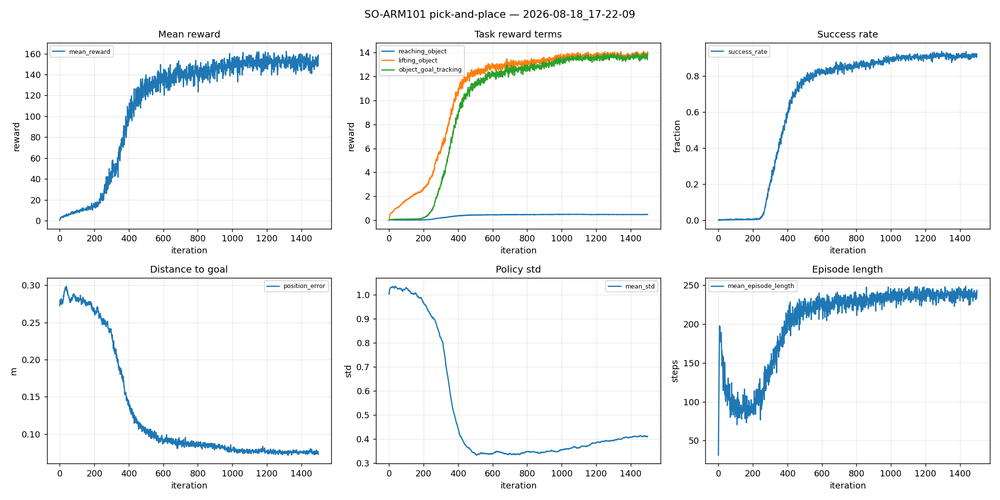

# Example: driving the env with an RL policy

Three ways to attach a driver to the same environment. Nothing changes on the env side.

The RL result is incidental — it just provides a real policy to talk to.

## 1. In-process

The env loads the checkpoint itself.

```yaml
control:
  source: rl_checkpoint
  checkpoint: logs/rsl_rl/pick_place_so101/<run>/model_1499.pt
  action_horizon: 1
```

```bash
python scripts/run.py --config configs/pick_place.yaml
```

## 2. Over a socket

The env holds a ZeroMQ client. The server never imports Isaac Sim.

```bash
# terminal 1
python scripts/policy_server.py --policy checkpoint \
    --checkpoint logs/rsl_rl/pick_place_so101/<run>/model_1499.pt

# terminal 2
python scripts/run.py --config configs/pick_place_teleop.yaml
```

Only the `control` block differs from (1):

```yaml
control:
  source: zmq
  endpoint: tcp://127.0.0.1:5555
  timeout_ms: 30000
```

## 3. Baselines

```bash
python scripts/run.py --config configs/pick_place.yaml --set control.source=zero
python scripts/run.py --config configs/pick_place.yaml --set control.source=random
```

Run these before trusting a policy. If it doesn't clearly beat `zero`, it isn't doing anything.

## Writing a driver

One method. The base class handles chunk caching and horizons.

```python
from simbridge.interfaces import ActionSource
from simbridge.registry import register_source

@register_source("my_policy")
class MyPolicy(ActionSource):
    def _predict_chunk(self, obs):
        obs.state["policy"]        # (num_envs, obs_dim) float32
        obs.images["scene_cam"]    # (num_envs, H, W, 3) uint8
        return actions             # (num_envs, act) or (horizon, num_envs, act)
```

Return a `(horizon, num_envs, act)` chunk and set `control.action_horizon` to execute it
open-loop before re-planning.

## Training

```bash
python experiment/scripts/train.py --rl_library rsl_rl --task SO101-PickPlace-v0 --num_envs 8192
python experiment/scripts/plot_rewards.py
python experiment/scripts/play.py --rl_library rsl_rl --task SO101-PickPlace-Play-v0 --num_envs 9 --video
```

No `--viz` means headless. Isaac Lab 3.0 has no `--headless` flag.

Video needs `pip install "moviepy<2" imageio-ffmpeg`. moviepy 2.x breaks — Isaac Lab's recorder
uses the v1 API.

### Result

92% success. 1500 iterations, 8192 envs, 78 minutes on one 4070 Ti.



[Policy video](docs/pick_place_policy.mp4)

| metric | start | final |
|---|---|---|
| `success_rate` | 0.000 | 0.921 |
| `lifting_object` | 0.04 | 14.02 |
| `object_goal_tracking` | 0.005 | 13.91 |
| object-to-goal distance | 0.272 m | 0.073 m |

Check `lifting_object` against `object_goal_tracking`. An earlier run ended at 4.53 vs 0.05 and
the policy just lifted the cube and held it — carrying paid nothing. Comparable values mean both
halves are being learned.

## Throughput

From `experiment/scripts/bench_envs.py` and `bench_camera.py` on this machine.

State-only, PhysX:

| envs | steps/s | VRAM | GPU % |
|---|---|---|---|
| 2048 | 55,425 | 3.5 GB | 40 |
| 8192 | 119,754 | 5.7 GB | 79 |
| 16384 | 142,034 | 8.3 GB | 88 |

8192 is the practical setting on 12 GB: 84% of peak throughput at two-thirds the VRAM. 16384
costs double the memory and startup for 19% more.

With cameras, 128 px, `TiledCamera`:

| envs | cams | env-steps/s | frames/s | VRAM |
|---|---|---|---|---|
| 512 | 1 | 27,378 | 27,378 | 10.1 GB |
| 256 | 2 | 13,904 | 27,809 | 9.1 GB |

Rendering costs about 4.4× versus state-only. `ms/step` is flat across env counts, so throughput
scales linearly and VRAM binds first. Ceiling is ~27k frames/s at 128 px, spent on either envs
or cameras.

So demo generation is cheap: 200 episodes is ~2s of sim, 2.5 GB on disk.

## Gotchas

Things that cost time here:

- Isaac Lab 3.0 quaternions are `(x,y,z,w)`. A `wxyz` value from 2.x code yaws the base wrong,
  silently.
- Shaping width has to match the distance the object travels, not the robot's size. Scaling
  `std` down for a smaller arm gave rewards of 0.0003 and 0.007 — dense on paper, flat in
  practice. Two runs died before this was obvious.
- `contrib.lift`'s curriculum ramps a smoothness penalty to -1e-1 at 10k env-steps. On this arm
  that hit -4.07 against a task reward of +3.19, so holding still paid better than lifting.
- `physics=newton_mjwarp` spends ~900 CPU-seconds on CoACD convex decomposition at scene build.
  PhysX does none. Everything here is PhysX.
- VRAM overflow doesn't raise on Windows. WDDM spills to host RAM and runs 11-151× slower, so
  judge fit by ms/iteration, not by whether it crashed.

## Contents

```
scripts/train.py          training entrypoint
scripts/play.py           playback, optional video
scripts/plot_rewards.py   TensorBoard curves, per-term reward breakdown
scripts/bench_envs.py     num_envs sweep
scripts/bench_camera.py   rendered throughput
docs/                     curves, video, raw benchmarks, flow-matching design study
```
